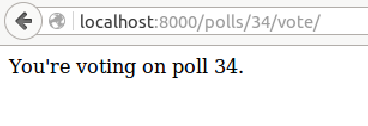
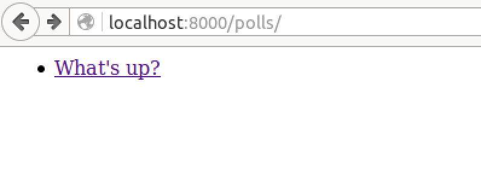
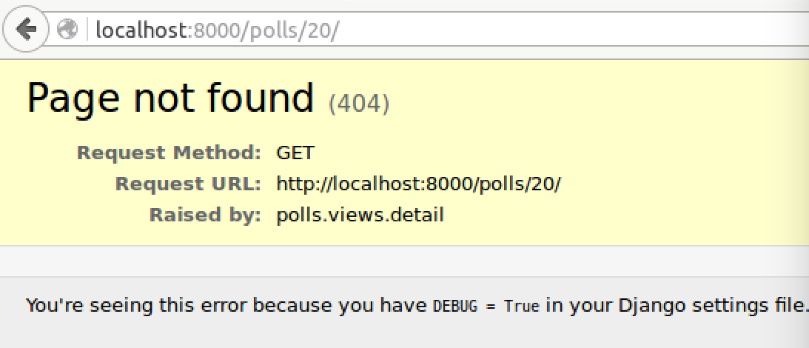
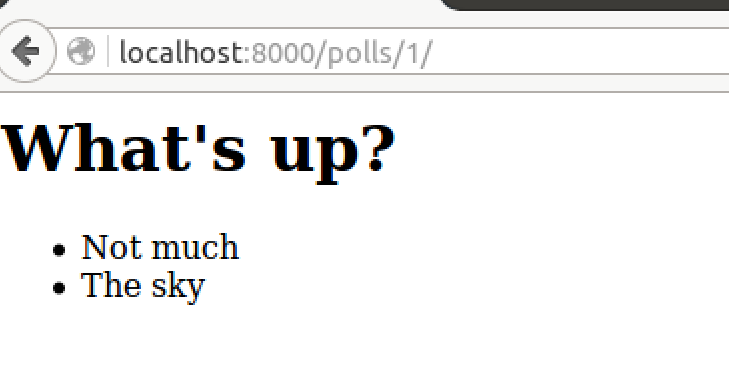

##编写你的第一个 Django 程序 第3部分
本教程上接 教程 第2部分 。我们将继续 开发 Web-poll 应用并且专注在创建公共界面 – “视图 （views ）”。

##哲理

在 Django 应用程序中，视图是一“类”具有特定功能和模板的网页。 例如，在一个博客应用程序中，你可能会有以下视图：

* 博客首页 – 显示最新发表的博客。
* 博客详细页面 – 一篇博客的独立页面。
* 基于年份的归档页 – 显示给定年份中发表博客的所有月份。
* 基于月份的归档页 – 显示给定月份中发表博客的所有日期。
* 基于日期的归档页 – 显示给定日期中发表的所有的博客。
* 评论功能 – 为一篇给定博客发表评论。

在我们的 poll 应用程序中，将有以下四个视图：

* Poll “index” 页 – 显示最新发布的民意调查。
* Poll “detail” 页 – 显示一项民意调查的具体问题，不显示该项的投票结果但可以进行投票的 form 。
* Poll “results” 页 – 显示一项给定的民意调查的投票结果。
* 投票功能 – 为一项给定的民意调查处理投票选项。

在 Django 中，网页及其他内容是由视图来展现的。而每个视图就是一个简单的 Python 函数（或方法， 对于基于类的视图情况下）。Django 会通过检查所请求的 URL （确切地说是域名之后的那部分 URL）来匹配一个视图。

平时你上网的时候可能会遇到像 “ME2/Sites/dirmod.asp?sid=&type=gen&mod=Core+Pages&gid=A6CD4967199A42D9B65B1B” 这种如此美丽的 URL。 但是你会很高兴知道 Django 允许我们使用比那优雅的 URL 模式 来展现 URL。

URL 模式就是一个简单的一般形式的 URL - 比如: /newsarchive/<year>/<month>/.

Django 是通过 ‘URLconfs’ 从 URL 获取到视图的。而 URLconf 是将 URL 模式 ( 由正则表达式来描述的 ) 映射到视图的一种配置。

本教程中介绍了使用 URLconfs 的基本指令，你可以查阅 django.core.urlresolvers 来获取更多信息。

##编写你的第一个视图

让我们编写第一个视图。打开文件 polls/views.py 并在其中输入以下 Python 代码

	from django.http import HttpResponse

	def index(request):
	    return HttpResponse("Hello, world. You're at the poll index.")
	    
在 Django 中这可能是最简单的视图了。为了调用这个视图，我们需要将它映射到一个 URL – 为此我们需要配置一个URLconf 。

在 polls 目录下创建一个名为 urls.py 的 URLconf 文档。 你的应用目录现在看起来像这样

	polls/
	    __init__.py
	    admin.py
	    models.py
	    tests.py
	    urls.py
	    views.py
	    
在 polls/urls.py 文件中输入以下代码：

	from django.conf.urls import patterns, url
	
	from polls import views
	
	urlpatterns = patterns('',
	    url(r'^$', views.index, name='index')
	)
	
	
下一步是将 polls.urls 模块指向 root URLconf 。在 mysite/urls.py 中插入一个 include() 方法，最后的样子如下所示

	from django.conf.urls import patterns, include, url
	
	from django.contrib import admin
	admin.autodiscover()
	
	urlpatterns = patterns('',
	    url(r'^polls/', include('polls.urls')),
	    url(r'^admin/', include(admin.site.urls)),
	)
	
现在你在 URLconf 中配置了 index 视图。通过浏览器访问 http://localhost:8000/polls/ ，如同你在 index 视图中定义的一样，你将看到 “Hello, world. You’re at the poll index.” 文字。

url() 函数有四个参数，两个必须的： regex 和 view， 两个可选的： kwargs， 以及 name。 接下来，来探讨下这些参数的意义。

###url() 参数: regex

regex 是 regular expression 的简写，这是字符串中的模式匹配的一种语法， 在 Django 中就是 url 匹配模式。 Django 将请求的 URL 从上至下依次匹配列表中的正则表达式，直到匹配到一个为止。

需要注意的是，这些正则表达式不会匹配 GET 和 POST 参数，以及域名。 例如：针对 http://www.example.com/myapp/ 这一请求，URLconf 将只查找 myapp/。而在http://www.example.com/myapp/?page=3 中 URLconf 也仅查找 myapp/ 。

如果你需要正则表达式方面的帮助，请参阅 Wikipedia’s entry 和本文档中的 re 模块。 此外，O’Reilly 出版的由 Jeffrey Friedl 著的 “Mastering Regular Expressions” 也是不错的。 但是，实际上，你并不需要成为一个正则表达式的专家，仅仅需要知道如何捕获简单的模式。 事实上，复杂的正则表达式会降低查找性能，因此你不能完全依赖正则表达式的功能。

最后有个性能上的提示：这些正则表达式在 URLconf 模块第一次加载时会被编译。 因此它们速度超快 ( 像上面提到的那样只要查找的不是太复杂 )。

####url() 参数： view

当 Django 匹配了一个正则表达式就会调用指定的视图功能，包含一个 HttpRequest 实例作为第一个参数和正则表达式 “捕获” 的一些值的作为其他参数。 如果使用简单的正则捕获，将按顺序位置传参数；如果按命名的正则捕获，将按关键字传参数值。 有关这一点我们会给出一个例子。

####url() 参数： kwargs

任意关键字参数可传一个字典至目标视图。在本教程中，我们并不打算使用 Django 这一特性。

####url() 参数： name

命名你的 URL ，让你在 Django 的其他地方明确地引用它，特别是在模板中。 这一强大的功能可允许你通过一个文件就可全局修改项目中的 URL 模式。

##编写更多视图

现在让我们添加一些视图到 polls/views.py 中去。这些视图与之前的略有不同，因为 它们有一个参数：:

	def detail(request, poll_id):
	    return HttpResponse("You're looking at poll %s." % poll_id)
	
	def results(request, poll_id):
	    return HttpResponse("You're looking at the results of poll %s." % poll_id)
	
	def vote(request, poll_id):
	    return HttpResponse("You're voting on poll %s." % poll_id)
	    
将新视图按如下所示的 url() 方法添加到 polls.urls 模块中去：:

	from django.conf.urls import patterns, url
	
	from polls import views
	
	urlpatterns = patterns('',
	    # ex: /polls/
	    url(r'^$', views.index, name='index'),
	    # ex: /polls/5/
	    url(r'^(?P<poll_id>\d+)/$', views.detail, name='detail'),
	    # ex: /polls/5/results/
	    url(r'^(?P<poll_id>\d+)/results/$', views.results, name='results'),
	    # ex: /polls/5/vote/
	    url(r'^(?P<poll_id>\d+)/vote/$', views.vote, name='vote'),
	)
	
在你的浏览器中访问 http://localhost:8000/polls/34/ 。将运行 detail() 方法并且显示你在 URL 中提供的任意 ID 。试着访问 http://localhost:8000/polls/34/results/ 和 http://localhost:8000/polls/34/vote/ – 将会显示对应的结果页及投票页。

当有人访问你的网站页面如 “ /polls/34/ ” 时，Django 会加载 mysite.urls 模块，这是因为 ROOT_URLCONF 设置指向它。接着在该模块中寻找名为urlpatterns 的变量并依次匹配其中的正则表达式。 include() 可让我们便利地引用其他 URLconfs 。请注意 include() 中的正则表达式没有 $ (字符串结尾的匹配符 match character) 而尾部是一个反斜杠。当 Django 解析 include() 时，它截取匹配的 URL 那部分而把剩余的字符串交由 加载进来的 URLconf 作进一步处理。

include() 背后隐藏的想法是使 URLs 即插即用。 由于 polls 在自己的 URLconf(polls/urls.py) 中，因此它们可以被放置在 “/polls/” 路径下，或 “/fun_polls/” 路径下，或 “/content/polls/” 路径下，或者其他根路径，而应用仍可以运行。

以下是当用户访问 “/polls/34/” 路径时系统中将发生的事：

* Django 将寻找 '^polls/' 的匹配
* 接着，Django 截取匹配文本 ("polls/") 后剩余的文本 – "34/" – 传递到 ‘polls.urls’ URLconf 中作进一步处理， 再将匹配 r'^(?P<poll_id>\d+)/$' 的结果作为参数传给 detail() 视图

	
	detail(request=<HttpRequest object>, poll_id='34')

poll_id='34' 这部分就是来自 (?P<poll_id>\d+) 匹配的结果。 使用括号包围一个 正则表达式所“捕获”的文本可作为一个参数传给视图函数；?P<poll_id> 将会定义名称用于标识匹配的内容； 而 \d+ 是一个用于匹配数字序列（即一个数字）的正则表达式。

因为 URL 模式是正则表达式，所以你可以毫无限制地使用它们。但是不要加上 URL 多余的部分如 .html – 除非你想，那你可以像下面这样：:

	(r'^polls/latest\.html$', 'polls.views.index'),
	
真的，不要这样做。这很傻。

##在视图中添加些实际的功能

每个视图只负责以下两件事中的一件：返回一个 HttpResponse 对象，其中包含了所请求页面的内容， 或者抛出一个异常，例如 Http404 。剩下的就由你来实现了。

你的视图可以读取数据库记录，或者不用。它可以使用一个模板系统，例如 Django 的 – 或者第三方的 Python 模板系统 – 或不用。它可以生成一个 PDF 文件，输出 XML ， 即时创建 ZIP 文件， 你可以使用你想用的任何 Python 库来做你想做的任何事。

而 Django 只要求是一个 HttpResponse 或一个异常。

因为它很方便，那让我们来使用 Django 自己的数据库 API 吧， 在 教程 第1部分 中提过。修改下 index() 视图， 让它显示系统中最新发布的 5 个调查问题，以逗号分割并按发布日期排序：

	from django.http import HttpResponse
	
	from polls.models import Poll
	
	def index(request):
	    latest_poll_list = Poll.objects.order_by('-pub_date')[:5]
	    output = ', '.join([p.question for p in latest_poll_list])
	    return HttpResponse(output)
	   
在这就有了个问题，页面的设计是硬编码在视图中的。如果你想改变页面的外观，就必须修改这里的 Python 代码。因此，让我们使用 Django 的模板系统创建一个模板给视图用，就使页面设计从 Python 代码中 分离出来了。

首先，在 polls 目录下创建一个 templates 目录。 Django 将会在那寻找模板。

Django 的 TEMPLATE_LOADERS 配置中包含一个知道如何从各种来源导入模板的可调用的方法列表。 其中有一个默认值是 django.template.loaders.app_directories.Loader ，Django 就会在每个 INSTALLED_APPS 的 “templates” 子目录下查找模板 - 这就是 Django 知道怎么找到 polls 模板的原因，即使我们 没有修改 TEMPLATE_DIRS, 还是如同在 教程 第2部分 那样。

***django的TEMPLATE_LOADERS放在TEMPLATES中***

	组织模板
	
	我们 能够 在一个大的模板目录下一起共用我们所有的模板，而且它们会运行得很好。 但是，此模板属于 polls 应用，因此与我们在上一个教程中创建的管理模板不同， 我们要把这个模板放在应用的模板目录 (polls/templates) 下而不是项目的模板目录 (templates) 。 我们将在 可重用的应用教程 中详细讨论我们 为什么 要这样做。
	
在你刚才创建的templates 目录下，另外创建个名为 polls 的目录，并在其中创建一个 index.html 文件。换句话说，你的模板应该是 polls/templates/polls/index.html 。由于知道如上所述的 app_directories 模板加载器是 如何运行的，你可以参考 Django 内的模板简单的作为 polls/index.html 模板。

将以下代码添加到该模板中:

	
	    <ul>
	    
	        <li><a href="/polls/{{ poll.id }}/">{{ poll.question }}</a></li>
	    
	    </ul>
	
	    
No polls are available.

	
现在让我们在 index 视图中使用这个模板：

	from django.http import HttpResponse
	from django.template import Context, loader
	
	from polls.models import Poll
	
	def index(request):
	    latest_poll_list = Poll.objects.order_by('-pub_date')[:5]
	    template = loader.get_template('polls/index.html')
	    context = Context({
	        'latest_poll_list': latest_poll_list,
	    })
	    return HttpResponse(template.render(context))
	    
	    代码将加载 polls/index.html 模板并传递一个 context 变量。 The context is a dictionary mapping template variable names to Python 该 context 变量是一个映射了 Python 对象到模板变量的字典。

在你的浏览器中加载 “/polls/” 页，你应该看到一个列表，包含了在教程 第1部分 中创建的 “What’s up” 调查。而链接指向 poll 的详细页面。

***报了一个错ImproperlyConfigured at /polls/
app_dirs must not be set when loaders is defined.***

将app_dirs置空

##抛出 404 异常

现在让我们解决 poll 的详细视图 – 该页显示一个给定 poll 的详细问题。 视图代码如下所示：:

	from django.http import Http404
	# ...
	def detail(request, poll_id):
	    try:
	        poll = Poll.objects.get(pk=poll_id)
	    except Poll.DoesNotExist:
	        raise Http404
	    return render(request, 'polls/detail.html', {'poll': poll})
	    
在这有个新概念：如果请求的 poll 的 ID 不存在，该视图将抛出 Http404 异常。

我们稍后讨论如何设置 polls/detail.html 模板，若是你想快速运行上面的例子， 在模板文件中添加如下代码：

	{{ poll }}
现在你可以运行了。

##快捷方式: get_object_or_404()

这很常见，当你使用 get() 获取对象时 对象却不存在时就会抛出 Http404 异常。对此 Django 提供了一个快捷操作。如下所示重写 detail() 视图：

	from django.shortcuts import render, get_object_or_404
	# ...
	def detail(request, poll_id):
	    poll = get_object_or_404(Poll, pk=poll_id)
	    return render(request, 'polls/detail.html', {'poll': poll})
	    
get_object_or_404() 函数需要一个 Django 模型类作为第一个参数以及 一些关键字参数，它将这些参数传递给模型管理器中的 get() 函数。 若对象不存在时就抛出 Http404 异常。

	哲理
	
	为什么我们要使用一个 get_object_or_404() 辅助函数 而不是在更高级别自动捕获 ObjectDoesNotExist 异常， 或者由模型 API 抛出 Http404 异常而不是 ObjectDoesNotExist 异常？
	
	因为那样会使模型层与视图层耦合在一起。Django 最重要的设计目标之一 就是保持松耦合。一些控制耦合在 django.shortcuts 模块中介绍。

还有个 get_list_or_404() 函数，与 get_object_or_404() 一样 – 不过执行的是 filter() 而不是 get() 。若返回的是空列表将抛出 Http404 异常。

##编写一个 404 ( 页面未找到 ) 视图

当你在视图中抛出 Http404 时，Django 将载入一个特定的视图来处理 404 错误。Django 会根据你的 root URLconf ( 仅在你的 root URLconf 中；在其他任何地方设置 handler404 都无效 ）中设置的 handler404 变量来查找该视图，这个变量是个 Python 包格式字符串 – 和标准 URLconf 中的回调函数格式是一样的。 404 视图本身没有什么特殊性：它就是一个普通的视图。

通常你不必费心去编写 404 视图。若你没有设置 handler404 变量，默认情况下会使用内置的 django.views.defaults.page_not_found() 视图。或者你可以在你的模板目录下的根目录中 创建一个 404.html 模板。当 DEBUG 值是 False ( 在你的 settings 模块中 ) 时， 默认的 404 视图将使用此模板来显示所有的 404 错误。 如果你创建了这个模板，至少添加些如“页面未找到” 的内容。

一些有关 404 视图需要注意的事项 :

* 如果 DEBUG 设为 True ( 在你的 settings 模块里 ) 那么你的 404 视图将永远不会被使用 ( 因此 404.html 模板也将永远不会被渲染 ) 因为将要显示的是跟踪信息。
* 当 Django 在 URLconf 中不能找到能匹配的正则表达式时 404 视图也将被调用。

##编写一个 500 ( 服务器错误 ) 视图
类似的，你可以在 root URLconf 中定义 handler500 变量，在服务器发生错误时 调用它指向的视图。服务器错误是指视图代码产生的运行时错误。

同样，你在模板根目录下创建一个 500.html 模板并且添加些像“出错了”的内容。

##使用模板系统

回到我们 poll 应用的 detail() 视图中，指定 poll 变量后，polls/detail.html 模板可能看起来这样 :

	<h1>{{ poll.question }}</h1>
	<ul>
	
	    <li>{{ choice.choice_text }}</li>
	
	</ul>
	

模板系统使用了“变量.属性”的语法访问变量的属性值。 例如 {{ poll.question }} ， 首先 Django 对 poll 对象做字典查询。 否则 Django 会尝试属性查询 – 在本例中属性查询成功了。 如果属性查询还是失败了，Django 将尝试 list-index 查询。

在  循环中有方法调用: poll.choice_set.all 就是 Python 代码 poll.choice_set.all(),它将返回一组可迭代的 Choice 对象，可以用在  标签中。

请参阅 模板指南 来了解模板的更多内容。

##移除模板中硬编码的 URLS

记得吗? 在 polls/index.html 模板中，我们链接到 poll 的链接是硬编码成这样子的：

	<li><a href="/polls/{{ poll.id }}/">{{ poll.question }}</a></li>

问题出在硬编码，紧耦合使得在大量的模板中修改 URLs 成为富有挑战性的项目。 不过，既然你在 polls.urls 模块中的 url() 函数中定义了 命名参数，那么就可以在 url 配置中使用  模板标记来移除特定的 URL 路径依赖:

	<li><a href="">{{ poll.question }}</a></li>
	
	Note
	
	如果  (含引号) 不能运行，但是  (不含引号) 却能运行，那么意味着你使用的 Djang 低于 < 1.5 版。这样的话，你需要在模板文件的顶部添加如下的声明：:
	
	>

其原理就是在 polls.urls 模块中寻找指定的 URL 定义。 你知道命名为 ‘detail’ 的 URL 就如下所示那样定义的一样：:

	...
	# 'name' 的值由  模板标记来引用
	url(r'^(?P<poll_id>\d+)/$', views.detail, name='detail'),
	...
	
如果你想将 polls 的 detail 视图的 URL 改成其他样子，或许像 polls/specifics/12/ 这样子，那就不需要在模板（或者模板集）中修改而只要在 polls/urls.py 修改就行了:

	...
	# 新增 'specifics'
	url(r'^specifics/(?P<poll_id>\d+)/$', views.detail, name='detail'),
	...
	
	
##URL 名称的命名空间

本教程中的项目只有一个应用：polls 。在实际的 Django 项目中，可能有 5、10、20 或者 更多的应用。Django 是如何区分它们的 URL 名称的呢？比如说，polls 应用有一个 detail 视图，而可能会在同一个项目中是一个博客应用的视图。Django 是如何知道 使用  模板标记创建应用的 url 时选择正确呢？

答案是在你的 root URLconf 配置中添加命名空间。在 mysite/urls.py 文件 (项目的 urls.py，不是应用的) 中，修改为包含命名空间的定义:

	from django.conf.urls import patterns, include, url
	
	from django.contrib import admin
	admin.autodiscover()
	
	urlpatterns = patterns('',
	    url(r'^polls/', include('polls.urls', namespace="polls")),
	    url(r'^admin/', include(admin.site.urls)),
	)
	
现在将你的 polls/index.html 模板中原来的 detail 视图:

	<li><a href="">{{ poll.question }}</a></li>
修改为包含命名空间的 detail 视图:

<li><a href="">{{ poll.question }}</a></li>
当你编写视图熟练后，请阅读 教程 第4部分 来学习如何处理简单的表单和通用视图。

	译者：Django 文档协作翻译小组，原文：Part 3: Views and templates。
	本文以 CC BY-NC-SA 3.0 协议发布，转载请保留作者署名和文章出处。
	Django 文档协作翻译小组人手紧缺，有兴趣的朋友可以加入我们，完全公益性质。交流群：467338606。
