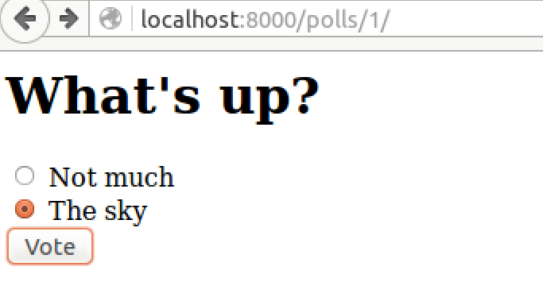
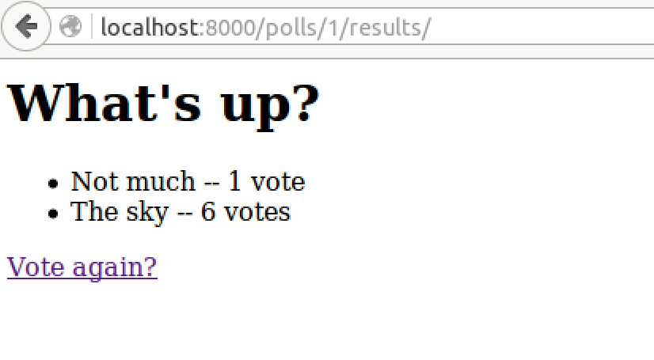

##编写你的第一个 Django 程序 第4部分
本教程上接 教程 第3部分 。我们将 继续开发 Web-poll 应用并且关注在处理简单的窗体和优化我们的代码。

###编写一个简单的窗体

让我们把在上一篇教程中编写的 poll 的 detail 模板更新下，在模板中包含 HTML 的

组件:
	<h1>{{ poll.question }}</h1>
	
	
<strong>{{ error_message }}</strong>

	
	<form action="" method="post">
	
	
	    <input type="radio" name="choice" id="choice{{ forloop.counter }}" value="{{ choice.id }}" />
	    <label for="choice{{ forloop.counter }}">{{ choice.choice_text }}</label> 
	
	<input type="submit" value="Vote" />
	</form>

简单的总结下:

* 上面的模板中为每个投票选项设置了一个单选按钮。每个单选按钮的 value 是投票选项对应的 ID 。每个单选按钮的 name 都是 “choice”。这意味着，当有人选择了一个单选按钮并提交了表单，将会发送 的 POST 数据是 choice=3。这是 HTML 表单中的基本概念。
* 我们将 form 的 action 设置为 ，以及设置了method="post"` 。使用 method="post" ( 而不是 method="get") 是非常重要的，因为这种提交表单的方式会改变服务器端的数据。 当你创建一个表单为了修改服务器端的数据时，请使用 method="post" 。这不是 Django 特定的技巧；这是优秀的 Web 开发实践。
* forloop.counter 表示 for 标签在循环中已经循环过的次数
* 由于我们要创建一个POST form ( 具有修改数据的功能 )，我们需要担心跨站点请求伪造 （ Cross Site Request Forgeries ）。 值得庆幸的是，你不必太担心这一点，因为 Django 自带了一个非常容易使用的系统来防御它。 总之，所有的 POST form 针对内部的 URLs 时都应该使用  模板标签。

现在，让我们来创建一个 Django 视图来处理提交的数据。 记得吗？在 教程 第3部分 中，我们为 polls 应用创建了一个 URLconf 配置中包含有这一行代码:

	url(r'^(?P<poll_id>\d+)/vote/$', views.vote, name='vote'),
	
我们还创建了一个虚拟实现的 vote() 函数。让我们创建一个真实版本吧。在 polls/views.py 中添加如下代码:

	from django.shortcuts import get_object_or_404, render
	from django.http import HttpResponseRedirect, HttpResponse
	from django.core.urlresolvers import reverse
	from polls.models import Choice, Poll
	# ...
	def vote(request, poll_id):
	    p = get_object_or_404(Poll, pk=poll_id)
	    try:
	        selected_choice = p.choice_set.get(pk=request.POST['choice'])
	    except (KeyError, Choice.DoesNotExist):
	        # Redisplay the poll voting form.
	        return render(request, 'polls/detail.html', {
	            'poll': p,
	            'error_message': "You didn't select a choice.",
	        })
	    else:
	        selected_choice.votes += 1
	        selected_choice.save()
	        # Always return an HttpResponseRedirect after successfully dealing
	        # with POST data. This prevents data from being posted twice if a
	        # user hits the Back button.
	        return HttpResponseRedirect(reverse('polls:results', args=(p.id,)))

在这代码中有些内容还未在本教程中提到过:

request.POST 是一个类似字典的对象，可以让你 通过关键字名称来获取提交的数据。在本例中， request.POST['choice'] 返回了所选择的投票项目的 ID ，以字符串的形式。 request.POST 的值永远是字符串形式的。

请注意 Django 也同样的提供了通过 request.GET 获取 GET 数据的方法 – 但是在代码中我们明确的使用了 request.POST 方法，以确保数据是通过 POST 方法来修改的。

如果 choice 未在 POST 数据中提供 request.POST['choice'] 将抛出 KeyError 当未给定 choice 对象时上面的代码若检测到抛出的是 KeyError 异常就会向 poll 显示一条错误信息。

在增加了投票选项的统计数后，代码返回一个 HttpResponseRedirect 对象而不是常见的 HttpResponse 对象。 HttpResponseRedirect 对象需要一个参数：用户将被重定向的 URL (请继续看下去在这情况下我们是如何构造 URL ) 。

就像上面用 Python 作的注释那样，当成功的处理了 POST 数据后你应该总是返回一个 HttpResponseRedirect 对象。 这个技巧不是特定于 Django 的；它是优秀的 Web 开发实践。

在本例中，我们在 HttpResponseRedirect 的构造方法中使用了 reverse() 函数。 此函数有助于避免在视图中硬编码 URL 的功能。它指定了我们想要的跳转的视图函数名以及视图函数中 URL 模式相应的可变参数。在本例中，我们使用了教程 第3部分中的 URLconf 配置， reverse() 将会返回类似如下所示的字符串

	'/polls/3/results/'
	
... 在此 3 就是 p.id 的值。该重定向 URL 会调用 'results' 视图并显示最终页面。

正如在教程 第3部分提到的，request 是一个 HttpRequest 对象。想了解 HttpRequest 对象更多的内容，请参阅 request 和 response 文档 。

当有人投票后，vote() 视图会重定向到投票结果页。让我们来编写这个视图

	def results(request, poll_id):
	    poll = get_object_or_404(Poll, pk=poll_id)
	    return render(request, 'polls/results.html', {'poll': poll})
	    
这几乎和 教程 第3部分 中的 detail() 视图完全一样。 唯一的区别就是模板名称。 稍后我们会解决这个冗余问题。

现在，创建一个 polls/results.html 模板:

	<h1>{{ poll.question }}</h1>
	
	<ul>
	
	    <li>{{ choice.choice_text }} -- {{ choice.votes }} vote{{ choice.votes|pluralize }}</li>
	
	</ul>
	
	<a href="">Vote again?</a>

现在，在浏览器中访问 /polls/1/ 并完成投票。每次投票后你将会看到结果页数据都有更新。 如果你没有选择投票选项就提交了，将会看到错误的信息。

##使用通用视图：优化代码

detail() ( 在 教程 第3部分 中) 和 results() 视图 都很简单 – 并且还有上面所提到的冗余问题。index() 用于显示 polls 列表的 index() 视图 (也在教程 第3部分中)，也是存在类似的问题。

这些视图代表了基本的 Web 开发中一种常见的问题： 根据 URL 中的参数从数据库中获取数据，加载模板并返回渲染后的内容。由于这类现象很 常见，因此 Django 提供了一种快捷方式，被称之为“通用视图”系统。

通用视图抽象了常见的模式，以至于你不需要编写 Python 代码来编写一个应用。

让我们把 poll 应用修改成使用通用视图系统的应用，这样我们就能删除删除一些我们自己的代码了。 我们将采取以下步骤来进行修改：

* 修改 URLconf 。
* 删除一些旧的，不必要的视图。
* 修正 URL 处理到对应的新视图。

请继续阅读了解详细的信息。

	为什么要重构代码？
	
	通常情况下，当你编写一个 Django 应用时，你会评估下通用视图是否适合解决你的问题， 如果适合你就应该从一开始就使用它，而不是进行到一半才重构你的代码。 但是本教程直到现在都故意集中介绍“硬编码”视图，是为了专注于核心概念上。
	
	就像你在使用计算器前需要知道基本的数学知识一样。
###修改 URLconf

首先，打开 polls/urls.py 的 URLconf 配置文件并修改成如下所示样子

	from django.conf.urls import patterns, url
	from django.views.generic import DetailView, ListView
	from polls.models import Poll
	
	urlpatterns = patterns('',
	    url(r'^$',
	        ListView.as_view(
	            queryset=Poll.objects.order_by('-pub_date')[:5],
	            context_object_name='latest_poll_list',
	            template_name='polls/index.html'),
	        name='index'),
	    url(r'^(?P<pk>\d+)/$',
	        DetailView.as_view(
	            model=Poll,
	            template_name='polls/detail.html'),
	        name='detail'),
	    url(r'^(?P<pk>\d+)/results/$',
	        DetailView.as_view(
	            model=Poll,
	            template_name='polls/results.html'),
	        name='results'),
	    url(r'^(?P<poll_id>\d+)/vote/$', 'polls.views.vote', name='vote'),
	)
	
###修改 views

在这我们将使用两个通用视图： ListView 和 DetailView 。这两个视图分别用于显示两种抽象概念 “显示一系列对象的列表” 和 “显示一个特定类型的对象的详细信息页”。

* 每个视图都需要知道使用哪个模型数据。因此需要提供将要使用的 model 参数。
* DetailView 通用视图期望从 URL 中捕获名为 "pk" 的主键值，因此我们将 poll_id 改为 pk 。

默认情况下， DetailView 通用视图使用名为 <应用名>/<模型名>_detail.html 的模板。在我们的例子中，将使用名为 "polls/poll_detail.html" 的模板。 template_name 参数是告诉 Django 使用指定的模板名，而不是使用自动生成的默认模板名。 我们也指定了 results 列表视图的 template_name – 这确保了 results 视图和 detail 视图渲染时会有不同的外观，虽然它们有一个 DetailView 隐藏在幕后。

同样的，~django.views.generic.list.ListView 通用视图使用的默认模板名为 <应用名>/<模型名>_list.html ；我们指定了 template_name 参数告诉 ListView 使用已经存在的 "polls/index.html" 模板。

在之前的教程中，模板提供的上下文中包含了 poll 和 latest_poll_list 上下文变量。在 DetailView 中 poll 变量是自动提供的 – 因为我们使用了一个 Django 模型 (Poll) ，Django 能够为上下文变量确定适合的名称。 另外 ListView 自动生成的上下文变量名是 poll_list 。若要覆盖此变量我们需要提供 context_object_name 选项， 我们想要使用 latest_poll_list 来替代它。作为一种替代方式，你可以改变你的模板来 匹配新的默认的上下文变量 – 但它是一个非常容易地告诉 Django 使用你想要的变量的方式。

现在你可以在 polls/views.py 中删除 index() ， detail() 和 results() 视图了。 我们不需要它们了 – 它们已替换为通用视图了。你也可以删除不再需要的 HttpResponse 导入包了。

运行服务器，并且使用下基于通用视图的新投票应用。

有关通用视图的完整详细信息，请参阅 通用视图文档.

当你熟悉了窗体和通用视图后，请阅读 教程 第5部分 来学习测试我们的投票应用。

	译者：Django 文档协作翻译小组，原文：Part 4: Forms and generic views。
	本文以 CC BY-NC-SA 3.0 协议发布，转载请保留作者署名和文章出处。
	Django 文档协作翻译小组人手紧缺，有兴趣的朋友可以加入我们，完全公益性质。交流群：467338606。

本文以 CC BY-NC-SA 3.0 协议发布，转载请保留作者署名和文章出处。

Django 文档协作翻译小组人手紧缺，有兴趣的朋友可以加入我们，完全公益性质。交流群：467338606。